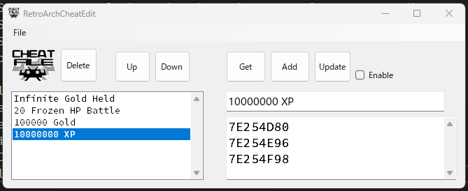

# RetroArchCheatEdit

RetroArchのchtファイルの編集を行うエディタです。<br>
<br>
以下がchtファイルのサンプルです。見れば分かりますが、順番変えたりとかするのが拷問です。<br>
エンコードがUTF-8なのは良いのですが、改行コードがLFだけのunixでよく見られる奴です。しかも、行の順は不定です。<br>
RetroArchで保存し直すと他にいっぱいパラメータが増えます。<br>
<br>
編集が死ぬほど辛いです。

```
cheats = "4"
cheat0_desc = "Infinite Gold Held"
cheat0_code = "7E3EA29F+7E3EA386+7E3EA401"
cheat0_enable = "false"
cheat1_desc = "20 Frozen HP Battle"
cheat1_code = "7E402E14"
cheat1_enable = "false"
cheat2_desc = "100000 Gold"
cheat2_code = "7E2551A0+7E255286+7E255301"
cheat2_enable = "false"
cheat3_desc = "10000000 XP"
cheat3_code = "7E254D80+7E254E96+7E254F98"
cheat3_enable = "false"
```

と言うわけで作ったエディタです。<br>
<br>
<br>
しかし、ファミコンもスーファミもPSPも同じchtファイルが使えるので実は楽です。


## License
This software is released under the MIT License, see LICENSE.

## Authors

bry-ful(Hiroshi Furuhashi)<br>
twitter:[bryful](https://twitter.com/bryful)<br>
bryful@gmail.com<br>

# References
